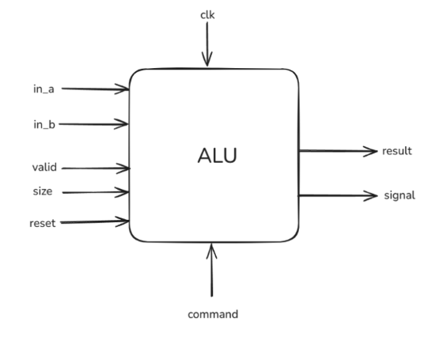

# Formal Verification of ALU design

This project focusses on a demonstration of debugging a ALU design using Formal Verification, which takes various inputs and produce outputs accordingly

## Proposed design

## Work done
* Designed specification file required for formal verification of ALU comprising of operations like AND, OR, ADD, SUB and MUL in C++.
* Designed an implication file too for the same ALU design using Verilog
* Constructed a testbench in TCL, framing assumes, lemmas, and covers to validate 16-bit and 32-bit result sizes for all possible inputs. 
* Conducted formal verification of the entire system using Synopsys VC Formal DPV 
* Debugged the RTL code by adding bugs to get hold on Synopsys Verdi tool.

> [!NOTE]
> The verification was done during my tenure at AMD India Private Limited as an intern. So, the outputs can't be shared.
